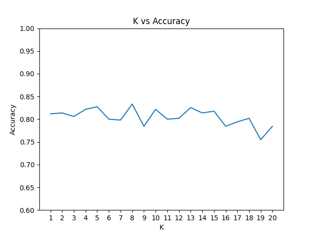

# Team

Austin Finlayson - finlaysona20@students.ecu.edu
Lucas Harrison - harrisonl19@students.ecu.edu

## Instructions

Open code and run in your preferred editor. We have used Jupyter Notebook and Spyder with Anaconda. 

## K Discussion

The K with the highest accuracy in the example graph is 8 with an accuracy of 83.3%. In general, accuracy seems hold steadily at around 80% until k = 14. I attempted to run k from 1 - 51 running each k 20 times, and the results shows k steadily decreasing when k > 14, with 1 < k < 14 seeming to be the highest average range. For this dataset, k's in this range seem to be equally reliable

## Line chart example output

