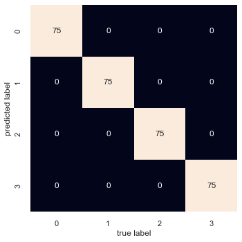

# Team

Austin Finlayson - finlaysona20@students.ecu.edu
Lucas Harrison - harrisonl19@students.ecu.edu

## Instructions

Open code and run in your preferred editor. We have used Jupyter Notebook and Spyder with Anaconda. 

## K Discussion

With the settings used for this projects' data, k = 4 is ideal and achieves an accuracy of 100%. 
The confusion matrix when using this K looks like this:

[75, 0, 0, 0]
[0, 75, 0, 0]
[0, 0, 75, 0]
[0, 0, 0, 75]

